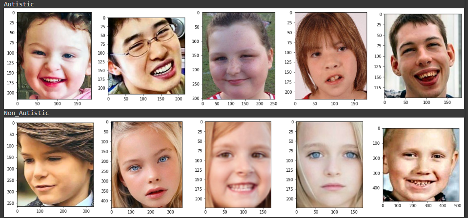

<h1>This repository for Machine-Learning Path<h1>

<h2>Machine Learning:</h2>
Collecting datasets, data preprocessing and building the model of autism detection. The data modeling is done by using ratio split folders experiment, preprocessing image (ImageDataGenerator, Image Augmentation), dropout, early stopping, and checkpoint. For the improvement, we try several transfer learning by VGG16, VGG19, MobileNet, MobileNetV2, InceptionV3, ResNet50, ResNet101, ResNet152, ResNet50V2, ResNet101V2, Xception, EfficientNetB0, EfficientNetB7. For the best model obtained, we do the fine-tuning to increase the accuracy. The latest model was saved with format .tflite and ready for deployment.
 
<h2>Datasets:</h2>

The original datasets can be obatined in https://www.kaggle.com/datasets/cihan063/autism-image-data. 

  
 
Preview Dataset

 
 
<h2>Requirements:</h2>
 
1. [Google Colaboratory](https://colab.research.google.com/) or [Jupyter Notebook](https://test-jupyter.readthedocs.io/en/latest/install.html)
2. [Python](https://www.python.org/downloads/) 3.7 or above
3. Tensorflow Latest Version
4. [Kaggle API](https://github.com/Kaggle/kaggle-api#api-credentials)
 

<h2>Google Colaboratory Notebook:</h2>
 
- [x] [Capstone_01](https://github.com/rafiechautie/Autism-detector-for-children/blob/main/Machine-Learning/Capstone.ipynb)
- [x] [Capstone_02](https://github.com/rafiechautie/Autism-detector-for-children/blob/main/Machine-Learning/Capstone_Rev.ipynb)
- [x] [Capstone_03](https://github.com/rafiechautie/Autism-detector-for-children/blob/main/Machine-Learning/Capstone_Rev2.ipynb)
 
<h2>Steps:</h2>
 <ol>
  <li>Import library needed</li>
  <li>Load data using Kaggle API Token</li>
  <li>Exploratory Data Analysis</li>
  <li>Preprocessing</li>
    <ol>
      <li>Split folders</li>
      <li>ImageDataGenerator</li>
      <li>Image Augmentation</li>
    </ol>
  </li>
  <li>Data Modeling (Dropout, EarlyStopping, ModelCheckPoint)</li>
    <ol>
      <li>Self-modeling</li>
      <li>Transfer Learning</li>
      <li>Fine-Tuning</li>
    </ol>
  </1i>
  <li>Save best model</li>
 <ol>
 
