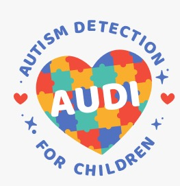
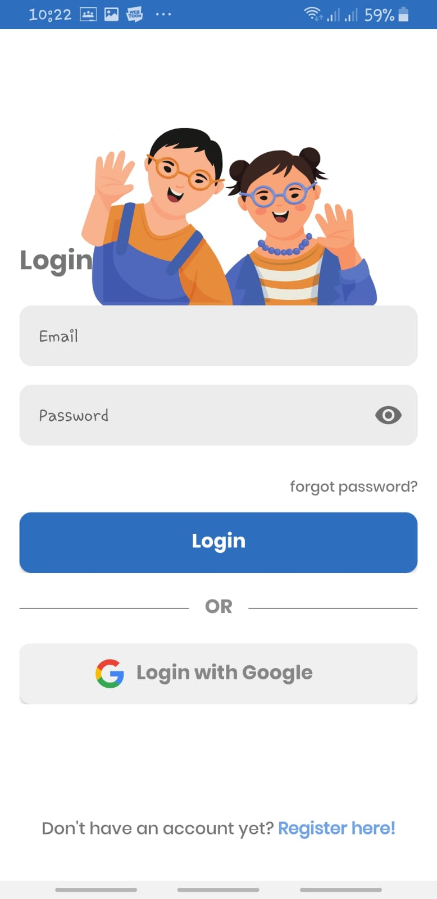
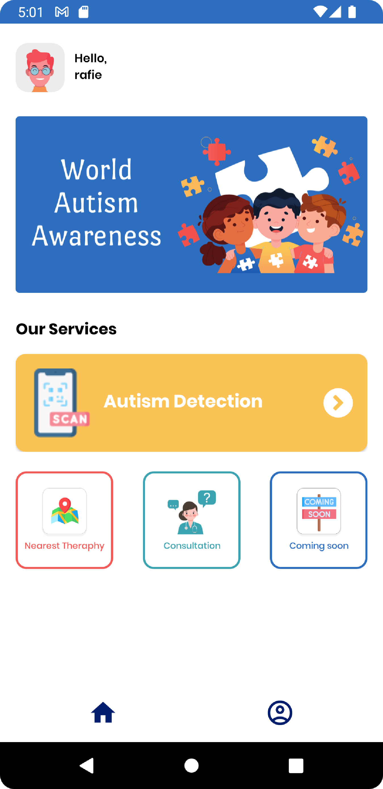

<h1 align="center">
  </img>
<br>
AUDI (Autism-detector-for-children)
</h1>

# Profile

### Team ID : C22-PS227

### Members

* M2123G1559 - [M. Mukhtarul Lathief](https://github.com/lathief)
* M2312G2705 - [Fida` Mardliyah](https://github.com/fidamardliyah)
* A7315F2747 - [Muhammad Rafie Chautie](https://github.com/rafiechautie)
* A7135K1608 - [Muhammad Rafli Salam](https://github.com/raflisalam)
* C2315F2745 - [Rizki Ade Ningsih](https://github.com/rizkiade18)
* C2135J1619 - [St. Rabiathul Ad'wiah Yusri](https://github.com/wiahy)

### Roles/personnel

* Machine Learning (M2123G1559 - M. Mukhtarul Lathief, M2312G2705 - Fida` Mardliyah)
* UI/UX & Android Development (A7315F2747 - Muhammad Rafie Chautie, A7135K1608 - Muhammad Rafli Salam)
* Cloud Computing (C2315F2745 - Rizki Ade Ningsih, C2135J1619 - St. Rabiathul Ad'wiah Yusri)

# AUDI
This project is our final project for Google Bangkit Academy 2021.

**Machine Learning:**
[AUDI - ML](https://github.com/rafiechautie/Autism-detector-for-children/tree/main/Machine-Learning)

**Cloud:**
[AUDI - Google Cloud](https://github.com/rafiechautie/Autism-detector-for-children/tree/main/Cloud-Computing)

**Android:**
[AUDI - Android](https://github.com/rafiechautie/Autism-detector-for-children/tree/main/Mobile-Development)


**Backgrounder:**

Autism is a syndrome of brain development that attacks the sufferer. The person that has autism syndrome usually has difficulty communicating and interacting with other people. This type of disorder has been present since childhood. Most parents don’t know that their children have autism symptoms. Most parents also have no knowledge about how to deal with autism syndrome for their children. The question is how can parents detect whether their child has autism or not? And how do they deal with it? With this application, the parents that have a child can detect whether their child has autism symptoms or not. By knowing earlier, the child who has autism syndrome can be treated earlier so that the changes to recovery are greater. With this application we also hope to provide nearby therapy place from user location. also with this application as the first check in predicting autism before doing a more detailed check by a doctor. Our team hopes the proposed application will be a solution for parents who have children with autism syndrome.

## Screenshots

<p align="center">
  
  
  
</p>

<p align="center">
  
  
  
</p>

<p align="center">
  
  
</p>


## Requirement
* Android Studio Bumblebee
* Android Device or Android Emulator 
* Emulator / External Device
* USB Cable (to Connect Android Device to your Computer)

## Installation

#### 1. Clone this Project to your Computer
```bash
git clone https://github.com/rafiechautie/Autism-detector-for-children.git
```

or you can use Android Studio 

File > New > Project from Version Control ...

#### 2. Open the Project in your Android Studio
Open Android Studio and select open an existing project.

#### 3. Run Project in Android Studio
Wait for Gradle Build to Finish and finally press the `Run > Run ‘app’`. Now the app has been installed in your phone / emulator. Make sure that you have configured your android device or emulator 

### the orther way

#### 1. download file APK in https://drive.google.com/file/d/13v1orGnO2W3ND_NGA3awuj4rSJ5-eB8A/view?usp=sharing 
### 2. install that file in your mobile phone

## Thank You :)
